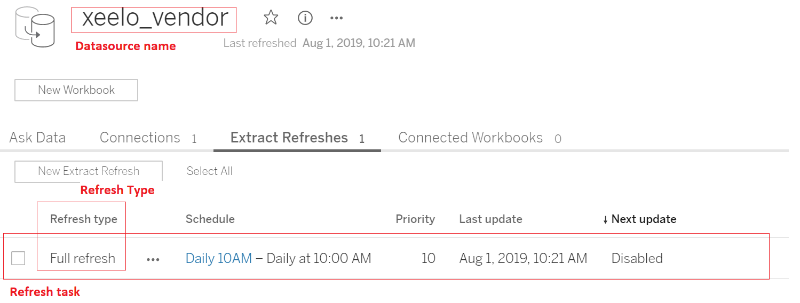

# Tableau extract trigger app

Component allowing to trigger Tableau extract refresh tasks directly from KBC.

**Table of contents:**  
  
[TOC]

# Configuration

## Tableau credentials

- **Token Name** - [REQ] Tableau user's PAT name. Note that the user must be owner of the dataset or Site admin.
- **Token Secret** - [REQ] Tableau user's PAT Secret
- **Endpoint** - [REQ] Tableu server API endpoint. Just the domain from the URL, e.g. `https://dub01.online.tableau.com`
- **Site ID** - [REQ] Tableu Site ID. Optional - for Tableau online. You can find the ID in the URL. 
E.g. **`SITE_ID`** in `https://dub01.online.tableau.com/#/site/SITE_ID/home`

### PAT

Since 02/2022 the PATs are required as a method of authentication. Follow [this guide](https://help.tableau.com/current/pro/desktop/en-us/useracct.htm#create-and-revoke-personal-access-tokens) to set it up 


## Poll mode

Specify whether the app should wait for all triggered tasks to finish. If set to `Yes` the trigger will wait for all triggered jobs to finish, 
otherwise it will trigger all the jobs and finish successfully right after.

## Tableau datasource specification

The trigger application is executing tasks / schedules that are defined on data sources. Specify a list of data sources 
with extracts to trigger in this section. 

**IMPORTANT NOTE** 

- there must be appropriate tasks/schedules set for all these sources otherwise the execution will fail.
- The datasource in Tableau Online must be published.

Each data source is uniquely defined by the `LUID`, which is only available via API and there's no way to retrieve it 
via the UI. For this reason the data source may be identified by several identifiers.

**Steps to set up the data source:**

1. Define data source name and optionally a tag.
2. Define the refresh task type. If not present create it first in the extract definition in Tableau.
3. After first run, look for the LUID outputted in the job log.
4. Set up LUID parameter to fix the unique identification of the data source.

### Data source name

Name of the datasource with extract refresh tasks to trigger as displayed in the UI (see image below). 
**NOTE** This may not be unique. If there's more sources with the same name found the trigger will fail and list of the available,
sources and its' eventual tags will be displayed in the job log. In such case you will need to add a tag to disambiguate.  

### Data source Tag 

Optional parameter defining a data source tag as found in Tableau. Use this to disambiguate the data source if there's 
more data sources with a same name.

### Tableu server unique LUID

Optional unique datasource identifier i.e. xx12-3324-1323,
available via API. This ensures unique identification of the datasource. If specified, the `tag` parameter is ignored.

#### LUID setup

If you don't know the LUID you may use unique combination of the `name` and `tag` parameters to identify the datasource. Once you run the configuration 
for the first time, the appropriate `LUID` will be displayed for each specified data source in the **job log**. Use it to update the `LUID` after first run 
to ensure unique match, since there may be more datasources with the same name and tag potentially in the future but LUID is unique at all times.


### Refresh type
 
Refresh type of the task that is specified for the data source. If the specified type of the refresh task is not defined, 
the job will fail.

## Tableau workbook specification

To refresh an embedded data source in a workbook.

**Steps to set up the data source:**

1. Define workbook name and optionally a tag.
2. After first run, look for the LUID outputted in the job log.
3. Set up LUID parameter to fix the unique identification of the workbook.

### Workbook name

Name of the workbook as displayed in the UI. 
**NOTE** This may not be unique. If there's more workbooks with the same name found the trigger will fail and list of the available,
sources and its' eventual tags will be displayed in the job log. In such case you will need to add a tag to disambiguate.  

### Workbook Tag 

Optional parameter defining a data source tag as found in Tableau. Use this to disambiguate the data source if there's 
more data sources with a same name.

### Tableu server unique LUID

Optional unique datasource identifier i.e. xx12-3324-1323,
available via API. This ensures unique identification of the workbook. If specified, the `tag` parameter is ignored.




**IMPORTANT NOTE:** Each datasource must have the required extract refresh set up, e.g. Full refresh, otherwise it won't be recognized and the trigger will fail. If more tasks of a same type are present, only one of them will be triggered.

## Development

If required, change local data folder (the `CUSTOM_FOLDER` placeholder) path to your custom path in the docker-compose file:

```yaml
    volumes:
      - ./:/code
      - ./CUSTOM_FOLDER:/data
```

### Example JSON configuration

```json
{
  "parameters": {
    "#password": "XXXXX",
    "user": "example@keboola.com",
    "site_id": "testsite",
    "endpoint":"https://dub01.online.tableau.com/",
    "datasources": [
      {"name":"FullTestExtract", "type": "RefreshExtractTask", "luid": "ecf7d5e0-c493-4e03-8d55-106f9f46af3b"},
      {"name":"IncrementalTestExtract", "type": "IncrementExtractTask", "luid": "ecf7d5e0-a345-4e03-8d55-106f9f46af1g"}
    ],
    "poll_mode": 1,
    "debug": false
  },
  "image_parameters": {}
}
```

**NOTE**: For generation of the config.json using a friendly GUI form use [this link](https://json-editor.github.io/json-editor/?data=N4Ig9gDgLglmB2BnEAuUMDGCA2MBGqIAZglAIYDuApomALZUCsIANOHgFZUZQD62ZAJ5gArlELwwAJzplsrEIgwALKrNSgogiFUJhO3cW1hRsulCADCCIjADmIqWVgIFUqgEcRMdwBNUANogIohUUgoAxBBkiIgU0v5sVPC+EGAw8EYgvs4xolIYNApp2Ni8dGC+umyIMFBUvDD+ALpsEFKQYbBFaMGh4b1aOoSIUFIZdgomZoQAKmR4ZmQiAAQhYSvwZAzFHTpSWgDyUlUDAIwADBcAvmxRMXEJGiBD5opjE1N1Mxbzi1TLNb9FbRWLxE4KEgyZyEUGPCFtPZdQTHU6oABMV1uIGSqXSmWerxGH3gk2M3zefyWq36ADcNgBBAAKAEkVri0hkoCsAKoAJQAMgoqkpxtA4PBCAApELcqCqFa+ehkDIgsgHFZEDp0Fbyqi8wUsdkAOjsxpWyigUAgiBQAHo7b4RHgLmdjTgMlRjeR/stjVg6LtOgcUScwhjGDcanUGk1Cdo3qNxqSvqZKQtqSsAMoxlYsgAi5p5oRWFDqyhWHvg+vpUlqrjYIowYpckt+Cpz9Tz+ZWGDI8BWeH1JBEKRWqr1BoFKAtVpt9sdztd7vguGr3ozAJE/vodoidtq9TtWZZswAorwC3blPRqiB2sGjmGBujGIxsSUyhUqvHhhZ4CIdBDuE5JpoQTJgKUKzfneTYthKhAskQKyhHKYArAABgAmjQGG6gqHx2HYGxllBFAqtyUIrHI2C6uMRFhFQvgrBw+iILq6G2PAMCIMoRpgHqUhliWdSljAUGEcRUjURJCqsXg7H9sxXE8RWiAiBghSxEQIilIIKz0Za1FEPUUjGkG+xPmiKAACxvkkAGBigAQXCwZytNkVBEMs2DiCgrngOKCDIL0ySAbw0w9EEAByYAKDhyDNNc2I5OQtCOFpv5vOqTiCKmPwgFSW6Krk6UFEUjY0M2MBBW2IACjx3JgMhqV5BlNBifK7IAB5jGQPDsVA6GSWE5qxV28rOPhjHQbKg76mQEAPu0MDOPqaUANaIAeKhMbpHWoZq0gybReolmVWmVoJwnrQqVDddwYgSmJUHeeJCgxnQIWgFCsh+SAdjjIkLwJnoBg8Plbxnr1TgQ2w7heD4TGBCAWw7MYZBkiA2DeMDRIectXQwD0oBo+YmigxYSafKBBX5rkKH5IUmzbF6wpVfBrgWAAPHgAB8fKeN4fjc3a/MrPT5CM+1LMMNR7EjmOqpFX6FnIqi4YoJcWIY5MgyU+8yZY5FhCS2Q0vlbqmPmZVoo1a2hCHLVcglVLF3rZj8tHaOzHK5uquIo+obWZiOvY7jWXEkbkNzJuNJhLWazcV4+oCjyBaVshk6te7KwABQxAZVDtDQyT1MxtKrSszIsgAlOzdu1Y7zu0aOMAp67bWW00ZcwLYGwwMaXorN13VnOiAC0ADMU/ojZE9nLPU9GmQtIqgI/wrJX5s1+aszKDx7JII4HVtx3PeZH3mDOM9zXTZ37vmkhKE6BgV9MUak4AOTkHYX9qk4BgplxzsXsJIPw5oABi4lToH1AQOMgJkNiTlsHWbk91Hqtj3gqNOGdSK0SHCCZM5dxwDknAGNI1ZMgsX0CsbAYAzRqxDBrAYU8rhRhBn+UAYUnJBEFlqGgyhoZ9R4PMRAG0FAsngM2NQZdhGwygGIiRHlICtm+jiRyEUKQhSCJA3S8g2BSJkQwTIcgQBJWMAbamKZaZvH4e4XiupQa22qk3Cw8j+rcncAIxxRJKreV0v9PRpQmFWU1jZdhyUonYl4mACgvAwgdDrIQLkYRPEIWMKoHYFg8BgAEkmRaNkQDJSAA)

Clone this repository, init the workspace and run the component with following command:

```
git clone repo_path my-new-component
cd my-new-component
docker-compose build
docker-compose run --rm dev
```

Run the test suite and lint check using this command:

```
docker-compose run --rm test
```

# Integration

For information about deployment and integration with KBC, please refer to the [deployment section of developers documentation](https://developers.keboola.com/extend/component/deployment/) 